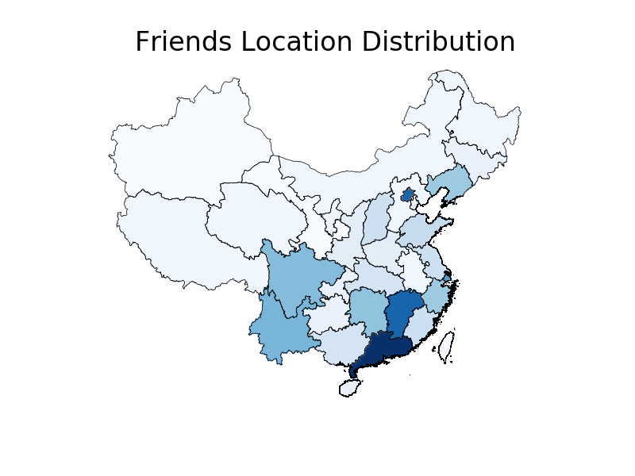
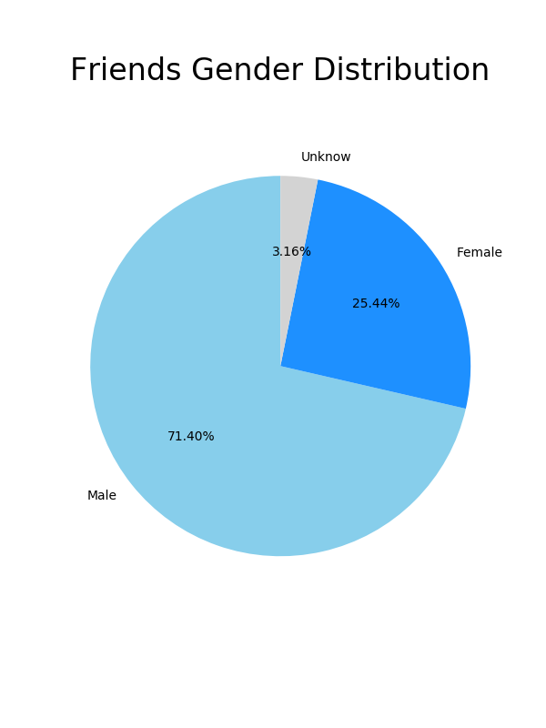

# 微信好友统计机器人  
以网页登录的方式统计微信好友的省份分布，性别分布。通过 文件传输助手 返回统计数据  

## 库依赖  
* [安装wxpy](https://github.com/youfou/wxpy/blob/master/docs/index.rst)  
* [安装basemap及geo](https://matplotlib.org/basemap/users/installing.html)(如果不需要可视化省份分布可不安装)  
```bash  
pip3 install -r requirements.txt   
```
## 运行  
```python  
python3 friends_distribution.py  
```
如果不需要可视化省份分布：  
```python  
python3 friends_distribution.py -map False  
```

## 效果
  
  
  